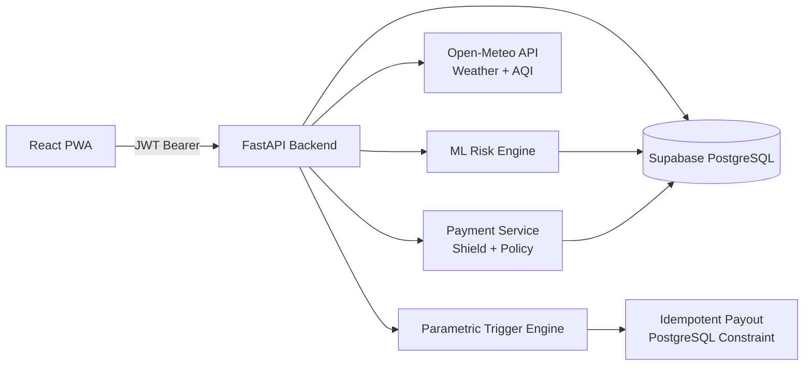

# Parametric Shield — Gig Worker Insurance Platform

> ML risk → premium shield → live weather triggers → secure idempotent payout

A full-stack parametric insurance application built for India's gig economy (Zomato, Swiggy, Ola, Rapido). Workers register, purchase a shield tier, and automatically receive payouts when real-world weather events exceed parametric thresholds — no manual claims required.

---

## Table of Contents
- [Problem Statement](#problem-statement)
- [How It Works](#how-it-works)
- [Architecture](#architecture)
- [Shield Tiers & Pricing](#shield-tiers--pricing)
- [Tech Stack](#tech-stack)
- [Project Structure](#project-structure)
- [Setup & Running](#setup--running)
- [API Reference](#api-reference)
- [Security: JWT Authentication](#security-jwt-authentication)
- [ML Model](#ml-model)
- [Database Schema](#database-schema)

---

## Problem Statement

Gig economy delivery workers rely entirely on daily earnings. External disruptions — heavy rain, hazardous AQI, curfews — can reduce their income by **20–30%** with zero protection. This platform provides:

- **Automated parametric triggers** based on live Open-Meteo weather data
- **ML-powered risk scoring** to personalize premiums
- **Idempotent payout engine** — one payout per event, no duplicates
- **7-day rolling shield** with tier-based coverage limits

---

## How It Works

```
Register → Purchase Shield Tier → Run ML Risk → Parametric Trigger → Secure Payout
```

1. **Register & Login** — bcrypt-hashed passwords + JWT access/refresh tokens
2. **ML Risk Score** — backend fetches live rain/AQI from Open-Meteo for device coordinates
3. **Shield Store** — choose Basic (₹49), Pro (₹99), or Elite (₹149); payment auto-creates 7-day policy
4. **Activate Trigger** — backend verifies live weather, logs event, validates policy, processes payout
5. **Weekly Earnings** — persistent across sessions; resets every 7 days from policy start

---

## Architecture



---

## Shield Tiers & Pricing

| Tier | Price | Coverage Limit | Triggers | 7-Day Policy |
|------|-------|----------------|----------|--------------|
| No Shield | ₹0 | ₹0 | None | — |
| Basic Shield | ₹49 | ₹150 | Rain, Heatwave | ✓ |
| Pro Armor | ₹99 | ₹300 | Rain, Heatwave, Traffic Halt | ✓ |
| Elite Armor | ₹149 | ₹450 | Rain, Heatwave, Curfew | ✓ |

Upgrades are pro-rated: upgrading from Basic → Pro costs **₹50**, not ₹99.

---

## Tech Stack

| Layer | Technology |
|-------|-----------|
| Frontend | React 18 + Vite (mobile PWA layout) |
| Backend | Python 3.11 + FastAPI + SQLAlchemy |
| Auth | PyJWT — 15min Access + 7d Refresh tokens |
| Database | Supabase (PostgreSQL) |
| Weather | Open-Meteo API (rain mm/h + AQI) |
| ML | scikit-learn (Ridge Regression ensemble) |
| Passwords | bcrypt |

---

## Project Structure

```
GuidewireDEVTrails2026-Hackathon/
├── backend/
│   ├── app/
│   │   ├── api/v1/endpoints/
│   │   │   ├── worker.py        # Register, Login, Refresh Token
│   │   │   ├── risk.py          # ML risk calculation (JWT protected)
│   │   │   ├── payment.py       # Shield upgrade + policy creation (JWT)
│   │   │   ├── event.py         # Parametric trigger (JWT protected)
│   │   │   └── payout.py        # Idempotent payout (JWT protected)
│   │   ├── core/
│   │   │   ├── db.py            # SQLAlchemy + Supabase connection
│   │   │   └── security.py      # JWT creation + get_current_worker
│   │   ├── models/
│   │   │   ├── db_models.py     # WorkerDB, PolicyDB, EventDB, PayoutDB, ShieldTierDB
│   │   │   └── entities.py      # Domain entities
│   │   ├── schemas/
│   │   │   └── contracts.py     # Pydantic request/response models
│   │   ├── services/
│   │   │   ├── risk_service.py  # ML inference pipeline
│   │   │   ├── weather_service.py # Open-Meteo live data
│   │   │   ├── event_service.py # Trigger detection + mass payout loop
│   │   │   ├── payout_service.py # Idempotency engine
│   │   │   └── validation_service.py # Policy + eligibility checks
│   │   └── main.py
│   ├── tests/
│   │   └── test_supabase_integration.py
│   └── requirements.txt
├── frontend/
│   └── src/
│       ├── GWApp.jsx            # Main app + all tabs
│       └── api.js               # JWT interceptor + silent refresh
└── ml/
    ├── model.py                 # Risk model training
    └── generate_data.py         # Synthetic training data
```

---

## Setup & Running

### Prerequisites
- Conda environment `gw` with Python 3.11
- Supabase project with connection string in `.env`

### Backend

```bash
cd backend
conda activate gw
pip install -r requirements.txt
uvicorn app.main:app --reload
```

Create `backend/.env`:
```
DATABASE_URL=postgresql://...your supabase connection string...
JWT_SECRET=your_jwt_secret_here
CORS_ORIGINS=http://127.0.0.1:5173,http://localhost:5173
ADMIN_EMAILS=admin@example.com
COOKIE_SECURE=false
```

### Frontend

```bash
cd frontend
npm install
npm run dev
```

App runs at `http://localhost:5173`. Backend must be running at `http://localhost:8000`.

Create `frontend/.env` if needed:
```env
VITE_API_URL=http://127.0.0.1:8000
```

---

## API Reference

### Public Endpoints (no auth required)
| Method | Path | Description |
|--------|------|-------------|
| POST | `/api/v1/workers/register` | Register new worker |
| POST | `/api/v1/workers/login` | Login → returns JWT pair |
| POST | `/api/v1/workers/refresh` | Refresh access token |

### Protected Endpoints (JWT `Authorization: Bearer <token>`)
| Method | Path | Description |
|--------|------|-------------|
| POST | `/api/v1/risk/calculate` | ML risk score from live weather |
| POST | `/api/v1/payment/process` | Purchase/upgrade shield + create 7d policy |
| POST | `/api/v1/event/trigger` | Detect weather event + trigger payouts |
| POST | `/api/v1/payout/process` | Process individual payout (idempotent) |

---

## Security: JWT Authentication

- **Access Token:** 15-minute lifetime. Sent in every `Authorization: Bearer` header.
- **Refresh Token:** 7-day lifetime. Stored in `localStorage`. Used to silently obtain new access tokens.
- **Silent Refresh:** `api.js` automatically retries a failed `401` request after refreshing the token.
- **Session Expiry:** If refresh also fails, `gw:session_expired` event is dispatched → user is logged out gracefully.
- **Cross-worker protection:** All protected endpoints verify `current_worker.id === payload.worker_id` to prevent spoofed requests.

---

## ML Model

Located in `ml/`. Uses a **Ridge Regression ensemble** trained on synthetic gig-worker data:

**Inputs:**
- Live rainfall (mm/h) from Open-Meteo at device GPS coordinates
- Live AQI from Open-Meteo
- Temperature, peak hour flag, location risk factor, working hours, shield base price

**Outputs:**
- `risk_score` (0–1)
- `premium_quote` (₹)
- `estimated_loss` (₹)
- `fraud_flag` (bool)

---

## Database Schema

```
workers         — id, name, email, hashed_password, location, income, active, shield (FK)
shields         — p_id (0–3), name
policies        — id, worker_id (FK), risk_score, premium, start_date, end_date, status
events          — id, type, severity, location, rainfall, aqi, timestamp
payouts         — id, worker_id (FK), event_id (FK), amount, status, idempotency_key (UNIQUE)
risk_profiles   — worker_id (FK), risk_score, timestamp
```

**Key constraint:** `UNIQUE(worker_id, event_id)` on `payouts` enforces idempotency at the database level — no double payouts even under concurrent load.

##  Pitch Deck

Get a complete overview of the project including the problem, solution, architecture, and business model.

 **Pitch Deck Link:**  
[View Pitch Deck](https://docs.google.com/presentation/d/1mjpnJ5JSXjX-rH-KKICJvqSdCaiSUHZN/edit?usp=drive_link&ouid=117303270450776072415&rtpof=true&sd=true)

---

### Contents of the Deck
- Problem Statement  
- Solution Overview  
- Product Workflow  
- System Architecture  
- Tech Stack  
- Business Model  
- Future Scope  
